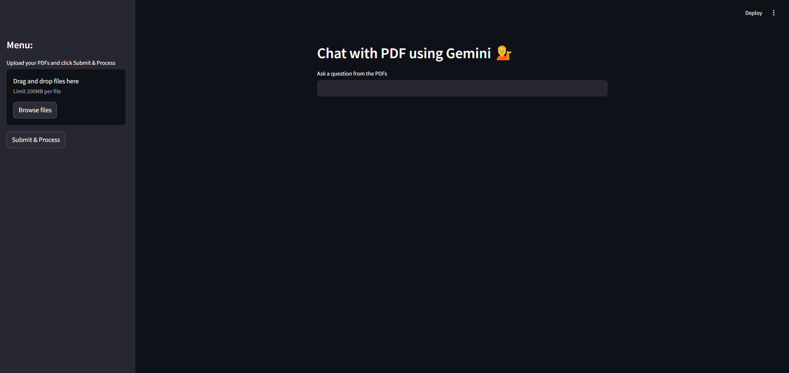

# 💁PDF Chat with Gemini

A Streamlit application that lets you chat with your PDF documents using Google's Gemini language model. Upload PDFs, process them, and ask questions to get insights from your documents.



## Features

- 📄 **PDF Upload**: Upload multiple PDF documents
- 🔍 **Text Extraction**: Automatically extracts text from uploaded PDFs
- 📚 **Vector Storage**: Creates embeddings using Google's embedding model
- 💬 **Natural Language Queries**: Ask questions in plain English about your PDFs
- 🤖 **Powered by Gemini**: Utilizes Google's Gemini 1.5 Pro model for generating responses

## Requirements

- Python 3.7+
- Google API Key with Gemini API access

## Installation

1. Clone this repository:
```bash
git clone https://github.com/Adiwanwade/pdf-chat-gemini.git

```

2. Install required packages:
```bash
pip install -r requirements.txt
```

3. Create a `.env` file in the project root with your Google API key:
```
GOOGLE_API_KEY=your_google_api_key_here
```

## Usage

1. Run the Streamlit app:
```bash
streamlit run app.py
```

2. Open your browser and navigate to the provided URL (typically http://localhost:8501)

3. Upload PDFs using the sidebar uploader

4. Click "Submit & Process" to extract text and create embeddings

5. Ask questions about your PDFs in the text input field

## How It Works

1. **Text Extraction**: The application extracts text from uploaded PDFs using PyPDF2.
2. **Text Chunking**: Text is split into manageable chunks using LangChain's RecursiveCharacterTextSplitter.
3. **Embedding Generation**: Google's embedding model converts text chunks into vector embeddings.
4. **Vector Storage**: Embeddings are stored in a FAISS index for efficient similarity search.
5. **Query Processing**: When you ask a question, the application retrieves relevant text chunks and passes them to the Gemini model to generate a contextual response.

## Dependencies

- streamlit: Web application framework
- PyPDF2: PDF text extraction
- langchain: Framework for LLM applications
- google-generativeai: Google Gemini API client
- FAISS: Vector database for similarity search
- python-dotenv: Environment variable management

## Contributing

Contributions are welcome! Please feel free to submit a Pull Request.

## License

This project is licensed under the MIT License - see the LICENSE file for details.

## Acknowledgements

- Google for providing the Gemini API
- LangChain for the awesome framework
- FAISS team for the vector storage solution